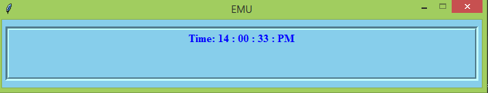

Realtime Clock
==============

Description
===========
`* A simple clock to show time in live mode.`

Preview
=======


Packages
========
```
* import time
* from tkinter import *
```
How it works
===========

```
* Clone the project.
* Open cmd and enter python main.py
```

